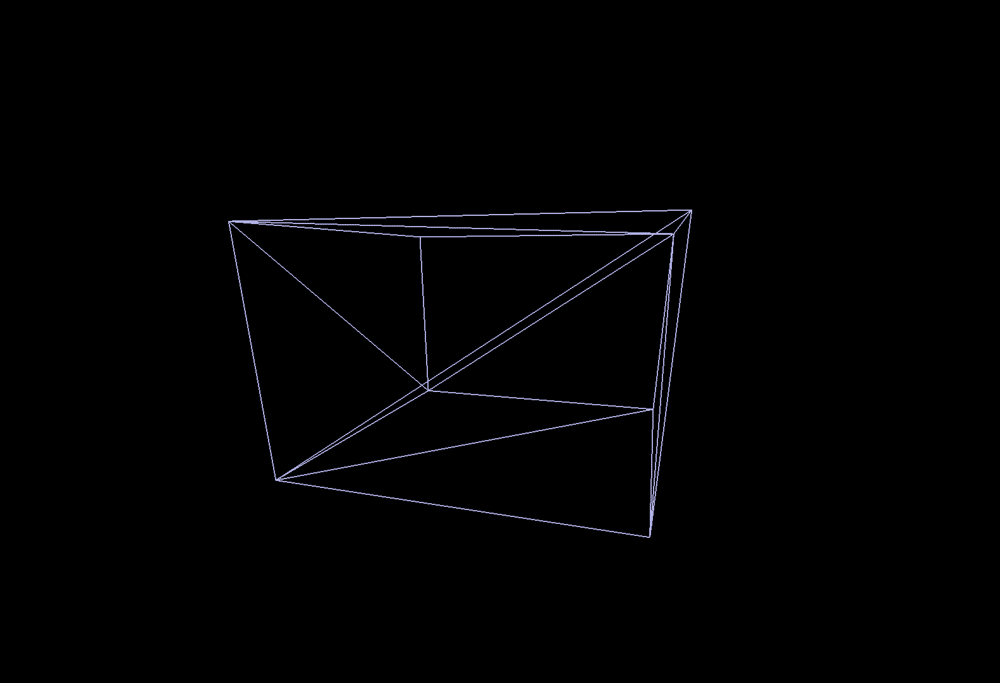
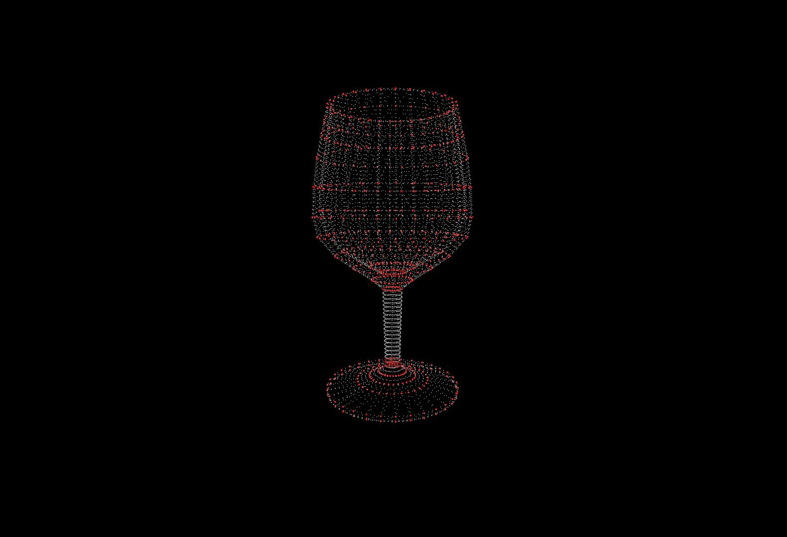
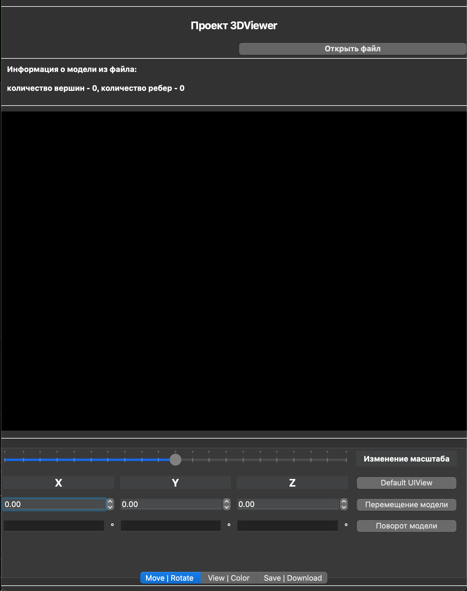
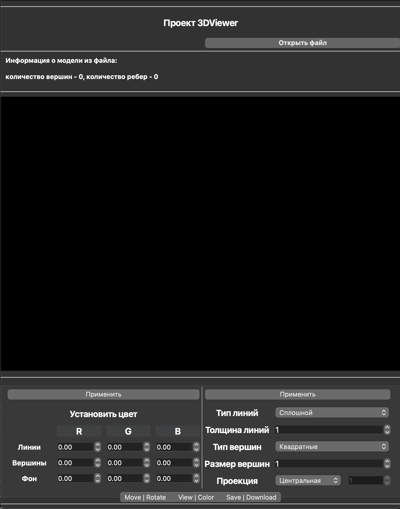
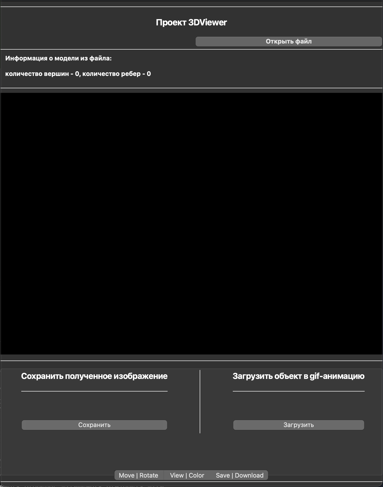

# :triangular_ruler: Программа "3DViewer"

 

**3D VIewer** - это приложение, которое поддерживает различные функции: просмотр файлов формата .obj и другие возможности для работы с выбранной пользователем 3D моделью

 GIF-изображение модели города с использованием приложения 3DViewer 

 

## 1. Назначение программы

 

GIF-изображение модели куба с использованием приложения 3DViewer 

 

Данная программа предназаначена для выполнения **следующих функций**:

- загрузки каркасных моделей из файла формата obj с поддержкой списка вершин и поверхностей;
- перемещения выбранной каркасной модели на заданное расстояние относительно осей X, Y, Z;
- поворота выбранной каркасной модели на заданный угол относительно своих осей X, Y, Z;
- маштабирования каркасной мoдели на заданное значение.

 

Для удобства взаимодействия пользователя с программой был разработан графический интерфейс, который содержит:

- кнопку для выбора файла с моделью и поле для вывода его названия;
- зону визуализации каркасной модели;
- кнопки и поля ввода для перемещения модели;
- кнопки и поля ввода для поворота модели;
- кнопки и поля ввода для масштабирования модели;
- информацию о загруженной модели - название файла, количество вершин и ребер.

В качестве специального режима реализованы "настройки", которые позволяют:

- настраивать тип проекции (параллельная и центральная);
- настраивать тип (сплошная, пунктирная), цвет и толщину ребер, способ отображения (отсутствует, круг, квадрат), цвет и размер вершин;
- выбирать цвет фона;
- сохранять настройки между перезапусками программы.

В качестве специального режима реализована "запись", которая: 

- позволяет сохранять полученные изображения в файл в форматах bmp и jpeg
- позволяет по специальной кнопке записывать небольшие "скринкасты" - текущие пользовательские аффинные преобразования загруженного объекта в gif-анимацию (640x480, 10fps, 5s)

## 2. Условия выполнения программы

- Операционная система - **MacOS**.

 

 GIF-изображение модели бокала с использованием приложения 3DViewer 

 

## 3. Выполнение программы

 

 GIF-изображение модели бокала с использованием приложения 3DViewer 

 

### Для выполнения программы требуется установить ее. Это можно сделать, выполнив следующую последовательность действий:

 

- Необходимо ввести **make install** в командной строке в рабочем каталоге **3DViewer/src** и нажать **Enter**;
- После загрузки перейти в созданный каталог **build**;
- Открыть приложение **"3Dviewer"**.

 

### Для завершения работы программы нажать красную кнопку с крестиком на верхней панели приложения. Для удаления приложения:

 

- Необходимо ввести **make uninstall** в командной строке в рабочем каталоге **3DViewer/src**** и нажать **Enter**;
- Далее ввести **make clean** в командной строке в рабочем каталоге **3DViewer/src** и нажать **Enter**.

 

### Для помещения компонентов программы в архив:

 

- Необходимо ввести **make dist** в командной строке в рабочем каталоге **3DViewer/src** и нажать **Enter**.

 

### Для проведения тестов над программой требуется:

- Необходимо ввести **make tests** в командной строке в рабочем каталоге **3DViewer/src** и нажать **Enter**.

 

### Для просмотра отчета с покрытием тестами программы требуется:

- Необходимо ввести **make gcov_report** в командной строке в рабочем каталоге **3DViewer/src** и нажать **Enter**.

 

### Для просмотра отчета с покрытием тестами программы требуется:

- Необходимо ввести **make gcov_report** в командной строке в рабочем каталоге **3DViewer/src** и нажать **Enter**.

 

### Для просмотра соответствия кода с Google-style:

- Необходимо ввести **make clang-format** в командной строке в рабочем каталоге **3DViewer/src** и нажать **Enter**.

 

### Для просмотра текста программы на утечки на *Linux*

- Необходимо ввести **make valgrind** в командной строке в рабочем каталоге **3DViewer/src** и нажать **Enter**.

 

### Для очистки рабочего каталога 

- Необходимо ввести **make clean** в командной строке в рабочем каталоге **3DViewer/src** и нажать **Enter**.

 

### Для просмотра документации

- Необходимо ввести **make html** в командной строке в рабочем каталоге **3DViewer/src** и нажать **Enter**.

 

## Выполнение функций:

 

 Изображение модели бокала с использованием приложения 3DViewer 

 

- *загрузка каркасной модели из файла формата obj с поддержкой списка вершин и поверхностей*.

 

Для загрузки модели необходимо нажать командную кнопку "Открыть файл" и выбрать требуемый файл с расширением .obj, в котором должен содержаться список вершин и поверхностей.

 

- *перемещение выбранной каркасной модели на заданное расстояние относительно осей X, Y, Z*.

 

Для перемещения требуется выбрать значение X, Y, Z и указать его в соответствующих полях напротив командной кнопки "Перемещение модели". В противном случае, будет указано базовое значение перемещения 0 по неуказанным полям.

 

- *поворот выбранной каркасной модели на заданный угол относительно своих осей X, Y, Z*.

 

Для перемещения требуется выбрать значение X, Y, Z и указать его в соответствующих полях напротив командной кнопки "Поворот модели". В противном случае, будет указано базовое значение поворота 0 по неуказанным полям.

 

- *маштабирования каркасной мoдели на заданное значение*.

 

Для изменения маштаба модели требуется выбрать значение и указать его в соответствующем поле напротив командной кнопки "Маштабирование модели". В противном случае, будет указано базовое значение поворота 0 по неуказанному полю.

 

- *настройки тип проекции (параллельная и центральная)*.

 

Для настройки типа проекции необходимо выбрать из выпадающего поля требуемое значение после текста "Проекция" и нажать "Применить" в "View|Color". Поле с числовым значением будет доступно только после нажатия значения типа "Параллельная" для изменения маштаба модели. 

 

- *настроек типа (сплошная, пунктирная), цвета и толщины ребер, способа отображения (отсутствует, круг, квадрат), цвета и размера вершин*.

 

Для настройки данных параметров (тип, толщина) необходимо выбрать из выпадающих полей требуемые значения или указать числа в полях ввода после соответсвующих текстовых меток и нажать "Применить" в "View|Color". 

 

Для настройки цвета необходимо указать числа в полях ввода (R - red, G - green, B - blue)  после соответсвующих текстовых меток "Фон" и нажать "Применить" в "View|Color". 

 

- *настройки цвета фона*.

 

Для настройки данного параметра необходимо указать числа в полях ввода (R - red, G - green, B - blue)  после соответсвующей текстовой метки "Фон" и нажать "Применить" в "View|Color". 

 

- *сохранения настроек между перезапусками программы*.

 

Сохранение происходит автоматически.

 

- *позволяет сохранять полученные изображения в файл в форматах bmp и jpeg*.

 

В "Save | Download" необходимо нажать "Сохранить" под текстом "Сохранить полученное изображение" и выбрать в появившимся окне - место и формат сохраняемого изображения.

 

- *позволяет по специальной кнопке записывать небольшие "скринкасты" - текущие пользовательские аффинные преобразования загруженного объекта в gif-анимацию (640x480, 10fps, 5s)*.

 

В "Save | Download" необходимо нажать "Сохранить" под текстом "Загрузить объект в gif-анимацию", в течение 5 секунд программа будет записывать изображение. После окончания записи необходимо выбрать в появившимся окне место, куда будет загружено сохраняемое изображение.

 

## Графический интерфейс

 

 Изображение экрана графического интерфеса 3DViewer 

 

 Изображение экрана графического интерфеса 3DViewer 

 

 Изображение экрана графического интерфеса 3DViewer 

 

